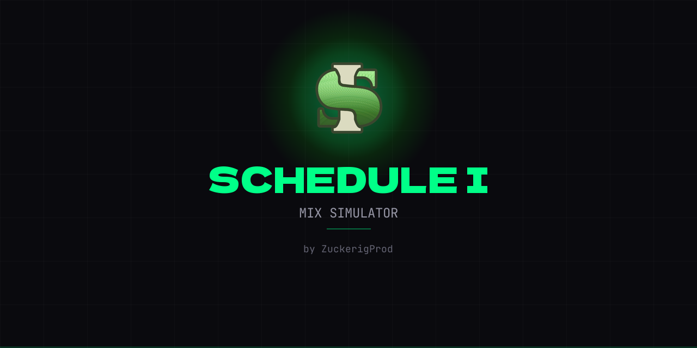

# Schedule I — Mix Simulator



A mix simulator for the game **Schedule I**. Created by **[ZuckerigProd](https://t.me/ZuckerigProd)** to make it easier and more fun to find the mixes you need.

## Features

- Mix simulation with exact in-game mechanics
- 2D effect map with reaction visualization
- Database of 62 customers with their preferences
- Market price, profit and margin calculation
- Recipe saving
- English and Russian languages

## Support the project

If you'd like to support the project:

<a href="https://www.donationalerts.com/r/zuckerigprod">
  
</a>

## Getting started

```bash
npm install
npm run dev
```

Open `http://localhost:3000`

## Build

```bash
npm run build
```

---

# Schedule I — Симулятор Миксов

Симулятор миксов для игры **Schedule I**. Создано **[ZuckerigProd](https://t.me/ZuckerigProd)**, чтобы вам было проще и интереснее подбирать нужные миксы.

## Возможности

- Симуляция миксов с точной механикой из игры
- 2D карта эффектов с визуализацией реакций
- База из 62 клиентов с их предпочтениями
- Расчёт рыночной цены, прибыли и маржи
- Сохранение рецептов
- Русский и английский языки

## Поддержать проект

Если хотите поддержать — буду благодарен:

<a href="https://www.donationalerts.com/r/zuckerigprod">
  
</a>

## Запуск

```bash
npm install
npm run dev
```

Открыть `http://localhost:3000`

## Сборка

```bash
npm run build
```
